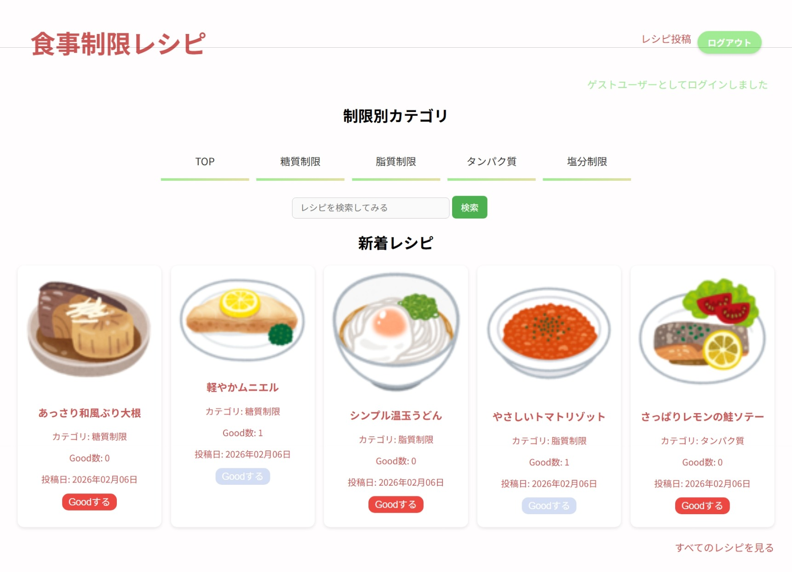

# 食事制限レシピ

食事制限のある人たちが美味しい料理を作って食べるためのレシピサイト

## サービス概要
栄養別にレシピを検索できます。
そのほかに、レシピの投稿、Goodボタンによる評価ができます。
## サービスURL
(https://nutritious-recipe.onrender.com/)
## サービスイメージ

## 開発背景
食事制限があると、レシピ探しが大変だったり、同じような食事になりがちです。

「似た悩みを持つ人たちが、レシピを共有して、色々な食事を楽しめたらいいな」  

という思いから、このサービスを開発しました。

## 主機能

- レシピの閲覧  
- ログインユーザーによるレシピ投稿・編集・削除  
- good ボタンによるレシピ評価  
- 栄養量（タンパク質・脂質・炭水化物など）での絞り込み検索  
- キーワード検索によるレシピ検索  
- 画像付きレシピ投稿（Cloudinary 使用）  
- TinyMCE によるリッチテキスト編集  

## フロントエンド
- HTML
- CSS
- JavaScript / Turbo
- TinyMCE
- Cloudinary

## バックエンド
- Rails 7.2.3
- Ruby  3.2.4
- PostgreSQL
- Devise
- Render

## インフラ・開発環境
- Render
- GitHub
- Cloudinary(画像保存)

## 今後の改善予定
- 栄養計算機能の追加  
- ユーザー同士のフォロー機能
- レシピのお気に入り保存
- レシピ(主食、副菜、デザート)別検索機能の追加

